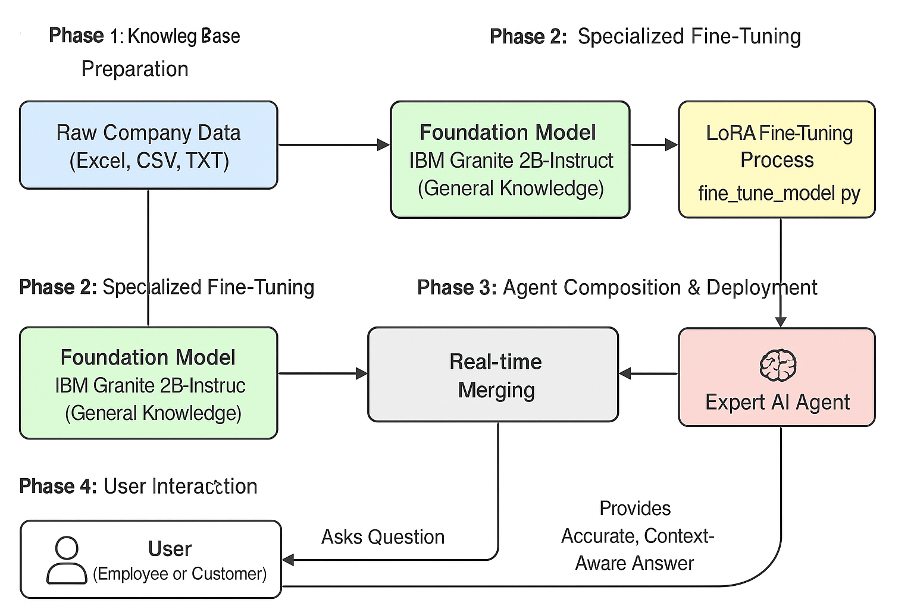

# Granite Company Agent

<div align="center">
  
  <br />
  <em>Diagram illustrating the Granite Company Agent workflow.</em>
</div>

## Overview

The **Granite Company Agent** is a lightweight, fine-tuned language model built on top of a base causal language model.  
It is designed to process structured company data (methodologies, courses, teachers, FAQs, testimonials) and provide accurate, context-aware responses to user queries.

### Key features:
- LoRA-based parameter-efficient fine-tuning.
- Easy dataset generation and preprocessing.
- Simple inference script to chat with the model.
- Built with Hugging Face Transformers, PEFT, and PyTorch.

---

## Repository Structure

```
granite-company-agent/
│
├── README.md
├── LICENSE
├── requirements.txt
│
├── train_granite.py       # Script to fine-tune the model
├── data_loader.py         # Utility to load CSV, XLSX, or TXT files
├── generate_data.py       # Generate synthetic company data
├── download_model.py      # Download base model from Hugging Face
├── chat_agent.py          # Simple inference/chat script
```
## Setup
### Clone the repository:
```
git https://huggingface.co/MateusBarros/granite-company-agent.git
cd granite-company-agent
```
### Install dependencies:
```
pip install -r requirements.txt

python generate_data.py
```
### Download the base model:
```
python download_model.py
```
### Training
Train the model on your dataset:
```
python train_granite.py
```
---

### Training configuration highlights:
- Epochs: 3
- Batch size: 2 (gradient accumulation used)
- Learning rate: 2e-4
- LoRA fine-tuning (low-rank adapters)
- BF16 precision
The trained model and tokenizer are saved in ./granite_company_agent.

---
### Inference / Chat
Use the agent interactively:

```
python chat_agent.py
```
Type your question and get responses from the fine-tuned model.
Type exit or quit to end the session.

---

### License
This project is released under the Apache-2.0 License.

---

### References
- Hugging Face Transformers
- PEFT: Parameter-Efficient Fine-Tuning
- PyTorch

### Author
- Mateus Barros
